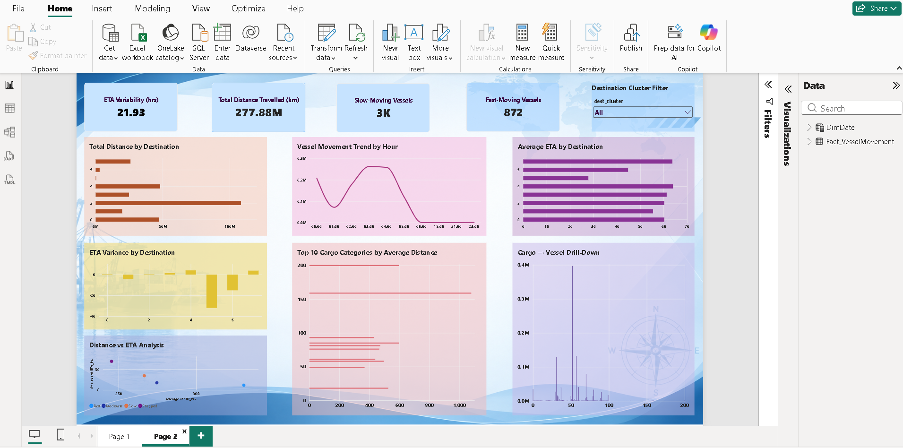

# Milestone 2 — Operational and Supply Chain Analytics

## Overview

Milestone 2 extends the Supply Chain Visibility System by focusing on operational and supply chain analytics using Microsoft Power BI. This milestone builds on the data model and KPI foundation established in Milestone 1 and introduces additional analysis of vessel movement, distance, destination, cargo, and ETA performance.

## Objectives

- Extend the existing Power BI dashboard with operational analytics
- Analyze vessel movement across destination clusters
- Monitor total distance travelled
- Analyze ETA behavior and variability
- Identify slow-moving and fast-moving vessels
- Analyze cargo movement patterns
- Provide interactive and drill-down based analysis

## Key Activities

- Development of additional DAX measures
- KPI enhancement
- Destination-wise analysis
- Cargo-wise analysis
- ETA variance analysis
- Hourly vessel movement trend analysis
- Drill-down analysis
- Distance and ETA relationship analysis
- Development of the Milestone 2 dashboard

## DAX Measures Developed

### 1. Total Distance Travelled (km)

```DAX
Total Distance Travelled (km) =
SUM('Fact_VesselMovement'[dist_km])

### 2. Slow-Moving Vessels

```DAX
Slow-Moving Vessels =
CALCULATE(
    DISTINCTCOUNT('Fact_VesselMovement'[MMSI]),
    'Fact_VesselMovement'[Speed_Category] = "Slow"
)
```

### 3. Fast-Moving Vessels

```DAX
Fast-Moving Vessels =
CALCULATE(
    DISTINCTCOUNT('Fact_VesselMovement'[MMSI]),
    'Fact_VesselMovement'[Speed_Category] = "Fast"
)
```

### 4. ETA Variability (hrs)

```DAX
ETA Variability (hrs) =
STDEV.P('Fact_VesselMovement'[ETA_hours])
```

### 5. ETA Variance (hrs)

```DAX
ETA Variance (hrs) =
AVERAGE('Fact_VesselMovement'[ETA_hours])
-
CALCULATE(
    AVERAGE('Fact_VesselMovement'[ETA_hours]),
    ALL('Fact_VesselMovement'[dest_cluster])
)
```

## Dashboard

The Milestone 2 dashboard provides additional operational insights through the following visualizations:

- ETA Variability KPI
- Total Distance Travelled KPI
- Slow-Moving Vessels KPI
- Fast-Moving Vessels KPI
- Total Distance by Destination
- Vessel Movement Trend by Hour
- Average ETA by Destination
- ETA Variance by Destination
- Top 10 Cargo Categories by Average Distance
- Cargo → Vessel Drill-Down
- Distance vs ETA Analysis
- Destination Cluster Filter

These visualizations allow users to explore vessel movement, destination performance, cargo patterns, distance travelled, and ETA behavior.

## Tools & Technologies

- Microsoft Power BI
- Power Query
- DAX
- Microsoft Excel
- Git & GitHub

## Screenshots

### M2 Dashboard



## Status

**Completed**


